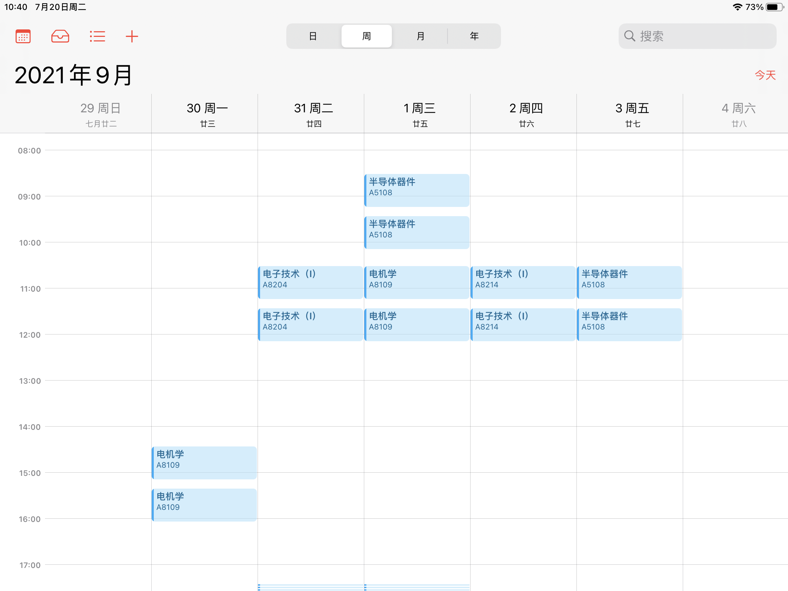

# 重庆大学课表 Excel 文件转 ics
## 简介

此项目可以将重庆大学教务管理系统下载的课表 excel 转为 ics 导入到支持 ics 导入的日历中

导出的 ics 文件经测试可以在 iOS、MacOS、Windows、以及基于 Android 的 RealmeUI 的内置日历中使用

## 使用方法
1.进入[重庆大学教务管理系统](http://my.cqu.edu.cn/enroll/CourseStuSelectionList)，登录后点击查看课表，右上方点击 Excel 下载按钮

2.打开下载的课表，另存为 Excel 97-2003 工作簿 （后缀名为 .xls），修改文件名为 `classtable`

3.下载本项目的两个py文件，将另存为得到的课表文件 `classtable.xls` 放在本项目同一目录（文件夹)中

4.先运行 `transform.py` ，再运行 `classtoics.py`

5.ics在该目录下就生成辣！可以自行导入到日历中

## 注意
1.理论上如果教务系统不再变化，可以一直使用

2.**您需要每学期修改 `classtoics.py` 文件的 line 33，时间为该学期的第一周的周一的日期，可以在重庆大学校历得到**

3.**默认每节课上课前 5 分钟会有日历提醒**，不想要的话可以将 `classtoics.py` 文件的 line 93 到 line 99 注释掉

4.基于 Python3，主要用到的库有 xlrd，xlwt，xlwings，icalendar

## 关于
本项目ics文件导出部分修改自 [classtable_to_isc](https://gitee.com/code_cloudlmy/classtable_to_isc) 项目，感谢原作者做出的贡献
